# Documentación Técnica - CI/CD DevOps

## Estructura del Proyecto

```
├── app.py                        # Código fuente Flask
├── Dockerfile                    # Imagen Docker
├── Jenkinsfile                   # Pipeline CD (Jenkins)
├── requirements.txt              # Dependencias Python
├── conftest.py                   # Configuración pytest
├── pytest.ini                    # Opciones pytest
├── tests/
│   └── test_app.py               # Pruebas unitarias
└── .github/
    └── workflows/
        └── ci.yml                # Pipeline CI (GitHub Actions)
├── prometheus.yml                # Código de configuración de Prometheus
├── requirements.txt               # Dependencias utilizadas para Observabilidad y Monitoreo
```

---

## Flujo CI/CD

1. **CI (GitHub Actions):**
   - Se ejecuta automáticamente en cada push/pull request.
   - Stages:
     - Checkout del código
     - Instalación de dependencias
     - Ejecución de pruebas (pytest)
     - Build de imagen Docker

2. **CD (Jenkins):**
   - Pipeline definido en Jenkinsfile.
   - Stages:
     - Clonar repositorio
     - Construir imagen Docker
     - Publicar imagen en DockerHub
   - Automatización: Se puede activar por webhook o Poll SCM.

---

## Configuración y Ejecución

### CI - GitHub Actions

- Archivo: `.github/workflows/ci.yml`
- Disparador: push/pull request a main
- Pruebas: `pytest tests/ -v`
- Build Docker: `docker build -t devops-app .`

### CD - Jenkins

- Archivo: `Jenkinsfile`
- Credenciales: `dockerhub-user` y `dockerhub-pass` (Secret Text)
- Publicación: `docker push geronimoav/devops-app:latest`
- Automatización: Webhook GitHub o Poll SCM

### Integración de herramientas de seguridad como

### Snyk

-Snyk se utiliza para validar vulnerabilidades de seguridad en las dependencias

-Se debe configurar en action de git hub donde se encuentra la integracion y dependencias

-Se necesita configurar un secret para poder conectarse con Snik web por medio de token

### Sonar Qube

-Sonar qube se debe instalar en el sistema donde corra el contendor en este caso Jenkins

-Se utiliza en CD para analizar automáticamente la calidad y seguridad del sofware

-Se necesita configurar un secret para poder conectarse a interfaz web por medio de token

- Muestra estadistica en interfaz grafica con el fin de informar los posibles errores de calidad de sofware

### Integración de herramientas de monitoreo como

### Prometheus

-Recolección de métricas

-Estándar de la industria para el monitoreo de sistemas modernos, ideal para la arquitectura de contenedores.

-Modelo de Pull: A diferencia de otros sistemas, Prometheus extrae los datos de tu aplicación (scrape). Esto evita que la aplicación se sature enviando métricas si el servidor de monitoreo está lento.

-Escalabilidad con Etiquetas: Utiliza un modelo de datos dimensional donde las métricas se identifican por nombre y etiquetas (labels). Esto permite filtrar y agregar datos de miles de contenedores de forma muy sencilla.

-Lenguaje de Consultas PromQL: Posee un lenguaje extremadamente potente para realizar cálculos matemáticos sobre las métricas en tiempo real (promedios, tasas de crecimiento, percentiles).

-Descubrimiento de Servicios: Es capaz de detectar automáticamente nuevos contenedores o instancias cuando se levantan, sin que tengas que configurar cada uno manualmente.

-Alertmanager: Permite configurar reglas de alerta complejas (ej. "Avisar si la CPU supera el 80% por más de 5 minutos") y enviarlas por Slack, Email o PagerDuty.

### Grafana

-Visualización de métricas.

-Proporciona tableros interactivos e intuitivos, conectándose de forma nativa con Prometheus.

-Dashboards Interactivos: Permite crear tableros visuales muy atractivos y dinámicos que se actualizan en tiempo real.

-Multifuente: Aunque brilla con Prometheus, puede mostrar datos de muchas fuentes al mismo tiempo (SQL, Elasticsearch, AWS CloudWatch, etc.) en un solo panel.

-Comunidad y Templates: Existen miles de dashboards preconfigurados por la comunidad que puedes importar en segundos (por ejemplo, para monitorear una app Flask o el estado de Docker).

-Control de Acceso: Permite gestionar usuarios y equipos con diferentes niveles de permisos (quién puede ver y quién puede editar los tableros).

-Alertas Visuales: Además de las alertas de Prometheus, Grafana puede resaltar paneles en rojo o enviar capturas de los gráficos cuando algo sale mal.

## Pantallazos Requeridos

1. **pruebas unitarias**
   - 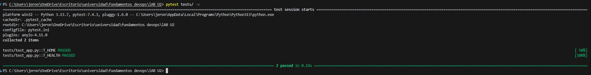
2. **Pipeline CI en GitHub Actions**
   - 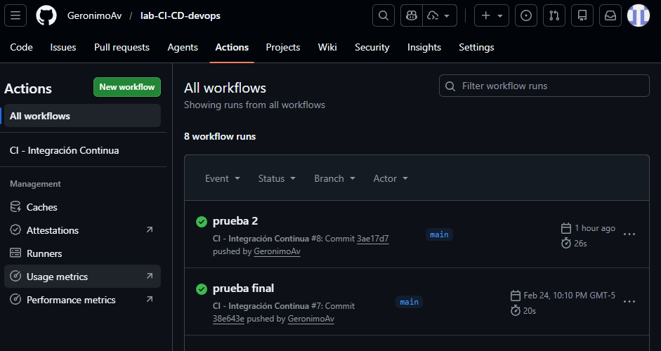

3. **Pipeline CD en Jenkins**
   - 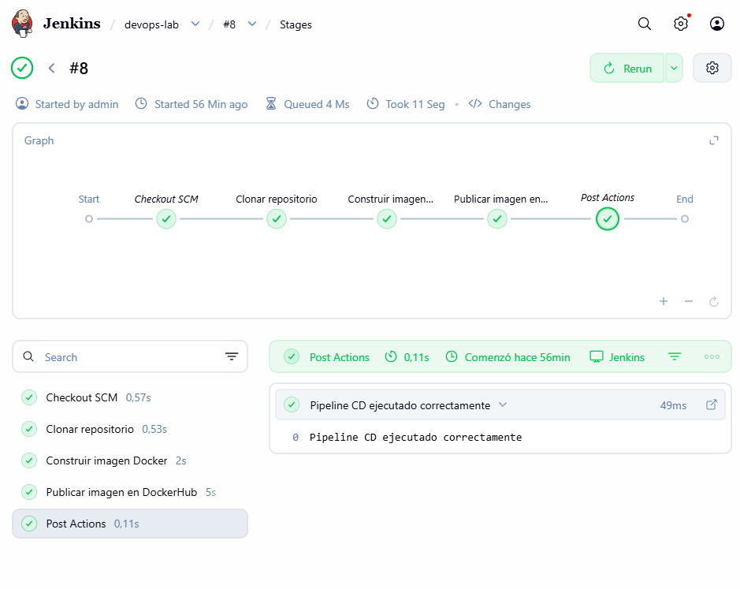

4. **DockerHub**
   - 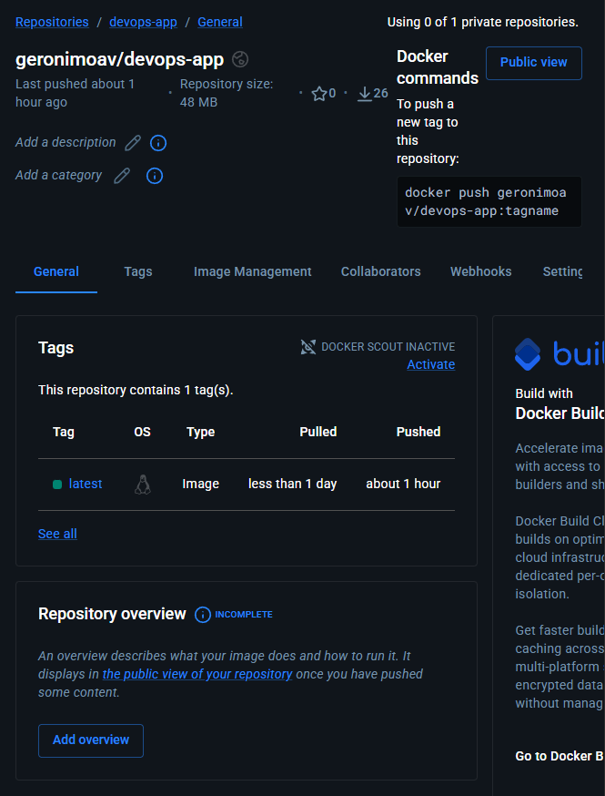
   - 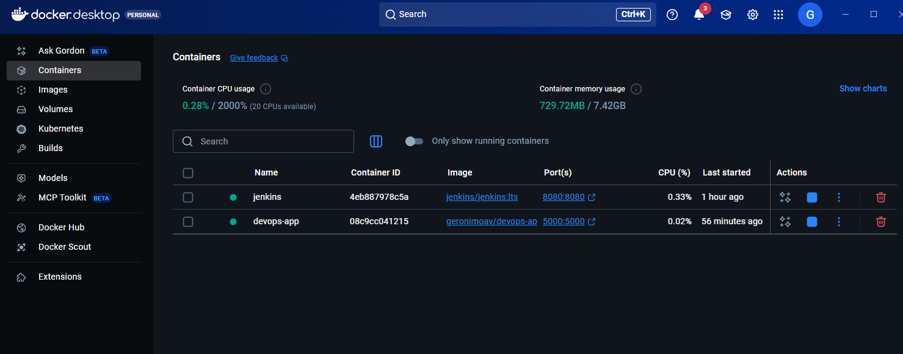

5. **Aplicación corriendo en local**
   - Navegador en `http://localhost:5000` mostrando respuesta JSON
     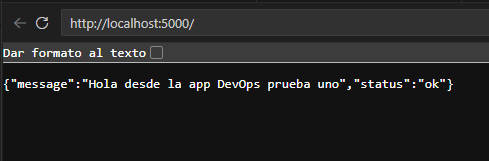

6. **Corriendo configuracion Snyk**

   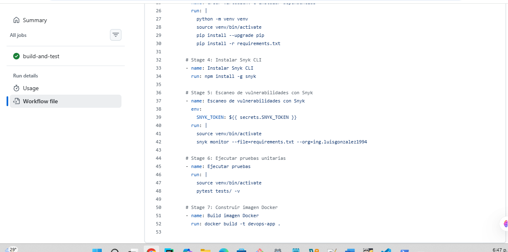

   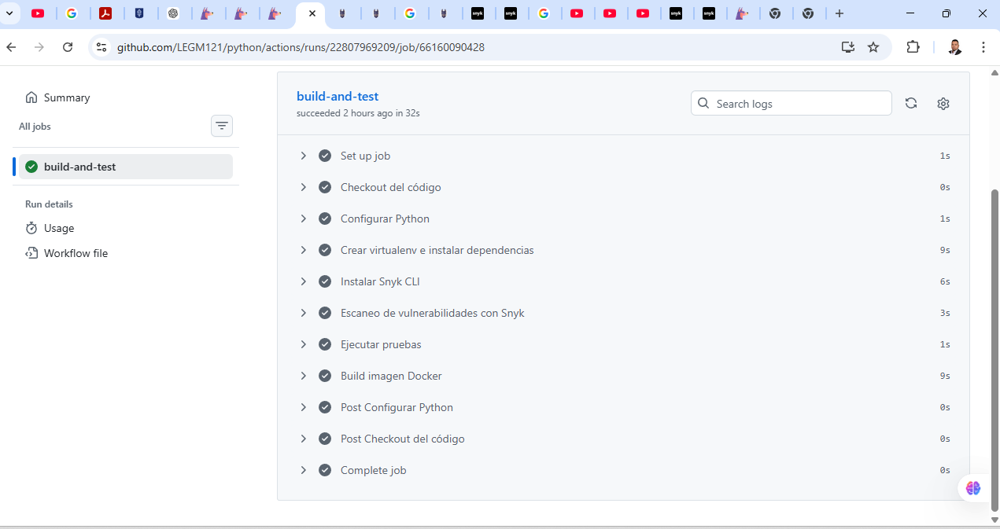

   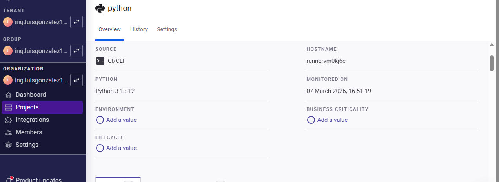

   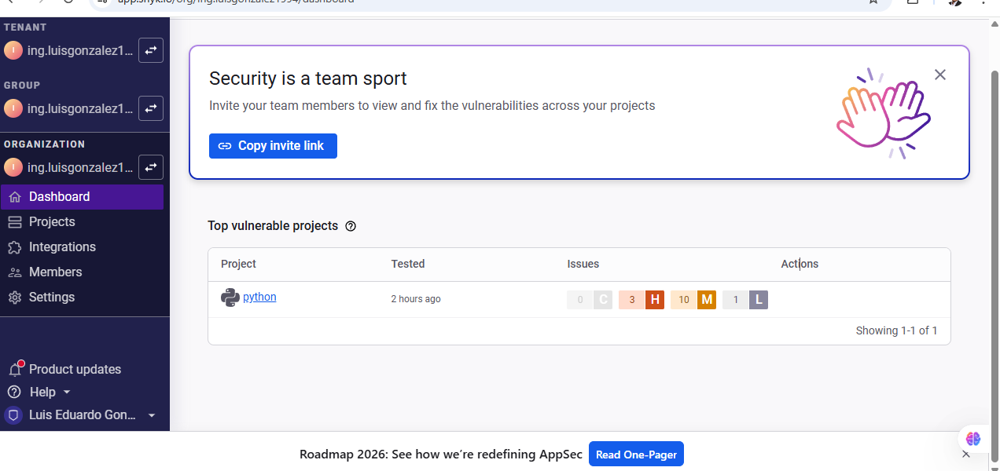

   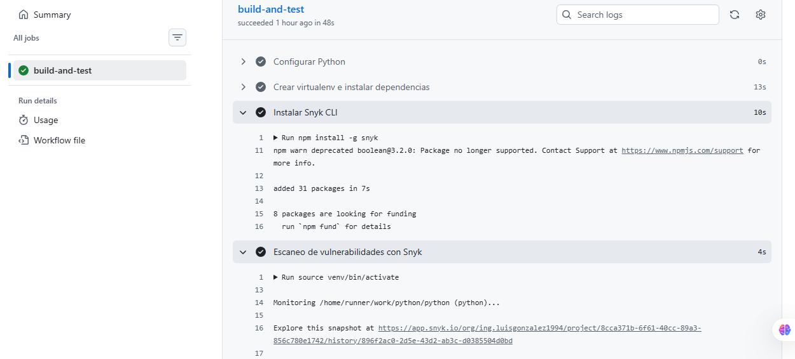

7. **Corriendo configuracion Sonar**

   Ejecucion correcta
   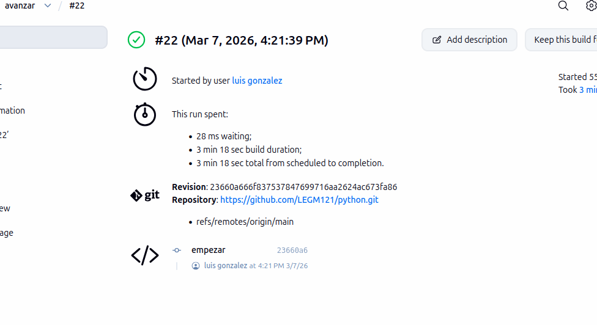
   llamado a sonar qube
   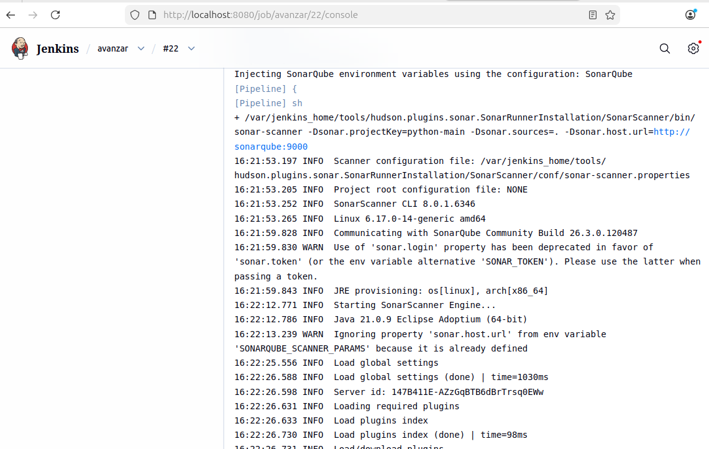

   Etapas correcta ejecutadas

   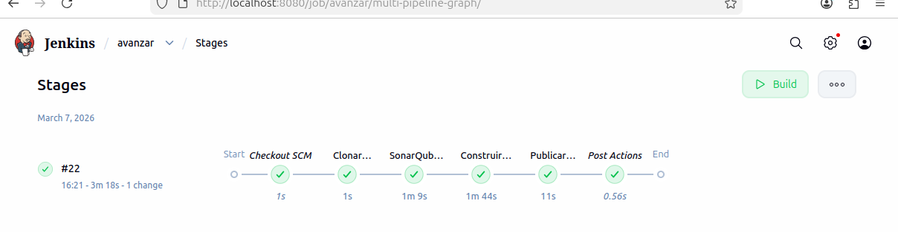

Se observan la estadisticas en la que se puede detallar algunas importantes como:

📊 1. Coverage (Cobertura de pruebas)

Mide qué porcentaje del código está cubierto por tests automáticos.

📉 2. Duplications

Porcentaje de código duplicado en el proyecto.

⭐ 3. Maintainability Rating

Calificación de mantenibilidad del código.

🔐 4. Security Rating

Calificación de seguridad basada en vulnerabilidades encontradas.

Calificación de mantenibilidad del código.
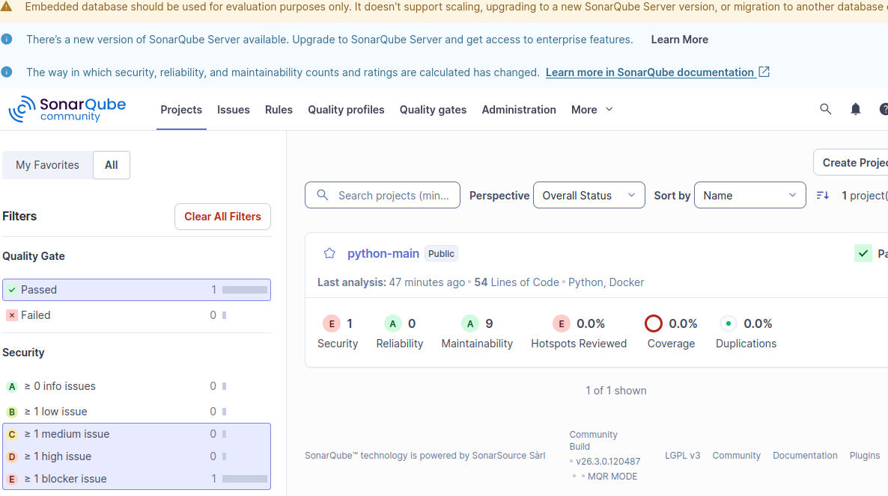

8. **Pruebas de observabilidad**

   **Panel 1: Uso de Memoria de la App**
   - 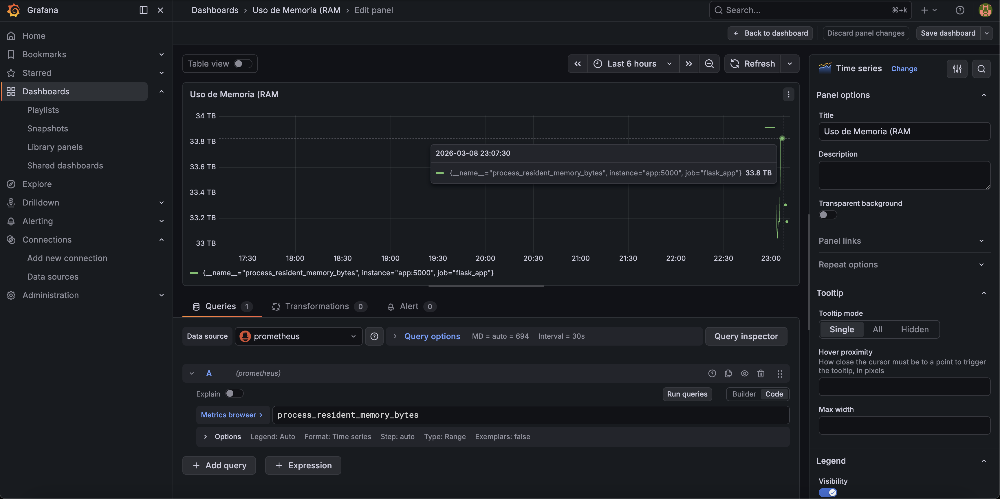

   **Panel 2: Uso de CPU**
   - 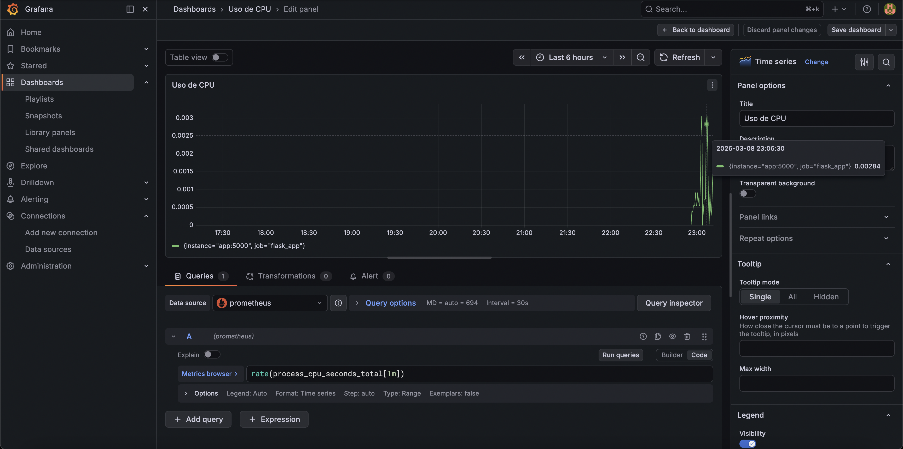

   **Panel 3: Peticiones HTTP (Tráfico)**
   - 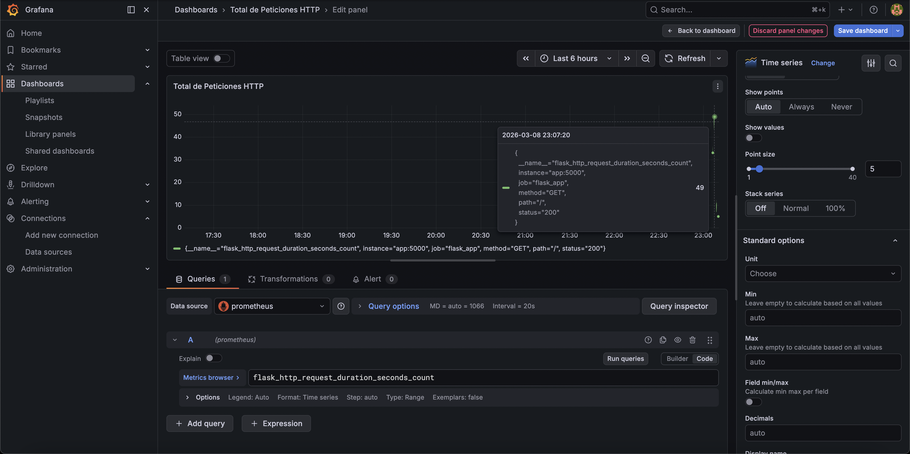

---

## Tutorial: Cómo realizar pruebas

### Detener y eliminar contenedores por separado

Para detener solo Jenkins:

```bash
docker stop jenkins
```

Para eliminar solo Jenkins:

```bash
docker rm jenkins
```

Para detener solo la app:

```bash
docker stop devops-app
```

Para eliminar solo la app:

```bash
docker rm devops-app
```

Para detener todos los contenedores:

```bash
docker stop $(docker ps -q)
```

Para eliminar todos los contenedores detenidos:

```bash
docker rm $(docker ps -aq)
```

Para detener y eliminar Jenkins y la app juntos:

```bash
docker stop devops-app jenkins
docker rm devops-app jenkins
```

Puedes verificar que no queda nada corriendo con:

```bash
docker ps
```

(Puedes agregar esta sección antes de las pruebas o al inicio del tutorial)

### Creación de contenedores Docker

#### 1. Contenedor Jenkins

Para crear el contenedor Jenkins con acceso a Docker:

```bash
docker run -d --name jenkins -p 8080:8080 \
  -v jenkins_home:/var/jenkins_home \
  -v /var/run/docker.sock:/var/run/docker.sock \
  jenkins/jenkins:lts
```

Esto permite que Jenkins ejecute comandos Docker desde el pipeline.

Accede a Jenkins en:

```
http://localhost:8080
```

#### 2. Contenedor de la aplicación

Para crear y ejecutar el contenedor de la app:

```bash
docker build -t devops-app:latest .
docker run -d --name devops-app -p 5000:5000 devops-app:latest
```

O desde DockerHub:

```bash
docker pull geronimoav/devops-app:latest
docker run -d --name devops-app -p 5000:5000 geronimoav/devops-app:latest
```

Accede a la app en:

```
http://localhost:5000
```

### 1. Instalar dependencias

Abre una terminal en la raíz del proyecto y ejecuta:

```bash
pip install -r requirements.txt
```

### 2. Ejecutar pruebas unitarias

Ejecuta las pruebas con pytest:

```bash
pytest tests/ -v
```

### 3. Probar la aplicación localmente

Construye y ejecuta la imagen Docker:

```bash
docker build -t devops-app:latest .
docker run -d --name devops-app -p 5000:5000 devops-app:latest
```

Abre tu navegador en:

```
http://localhost:5000
```

Deberías ver el mensaje JSON de bienvenida.

### 4. Probar la ruta de salud

En el navegador o usando curl:

```
http://localhost:5000/health
```

Respuesta esperada:

```
{"status": "healthy"}
```

### 5. Detener y eliminar el contenedor

```bash
docker stop devops-app
docker rm devops-app
```

### 6. Indicaciones de comandos Snik

name: Instalar Snyk CLI
run: npm install -g snyk
source venv/bin/activate
snyk monitor --file=requirements.txt --org=ing.luisgonzalez1994

### 7. Indicaciones de Sonar qube

1.Obtener la ruta de SonarScanner
def scannerHome = tool 'SonarScanner'
/var/jenkins_home/tools/.../sonar-scanner

2. Usar las credenciales/configuración de SonarQube
   withSonarQubeEnv('SonarQube') {

3. Ejecutar comandos en la terminal del agente
   sh """

sh significa shell command.

Jenkins ejecuta los comandos dentro de un agente Linux o contenedor

4. Ejecutar SonarScanner
   ${scannerHome}/bin/sonar-scanner

Esto ejecuta el programa SonarScanner desde la ruta que Jenkins encontró.

5. Parámetros del análisis
   -Dsonar.projectKey=python-main

Define el ID del proyecto en SonarQube.

-Dsonar.sources=.

Indica que el código a analizar está en el directorio actual (.).
